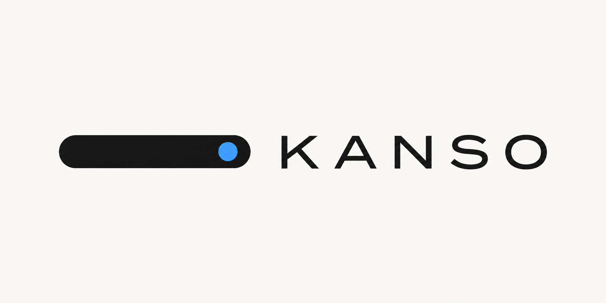
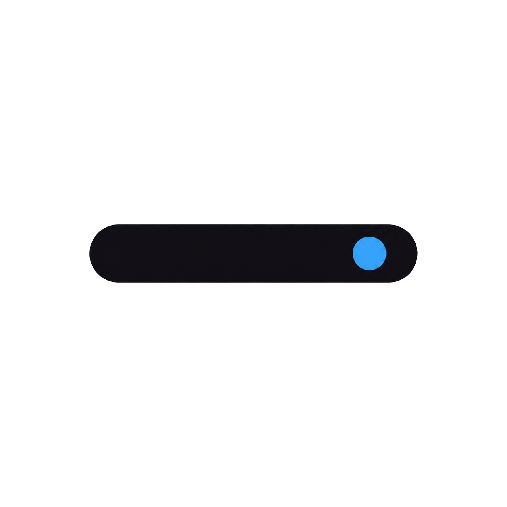
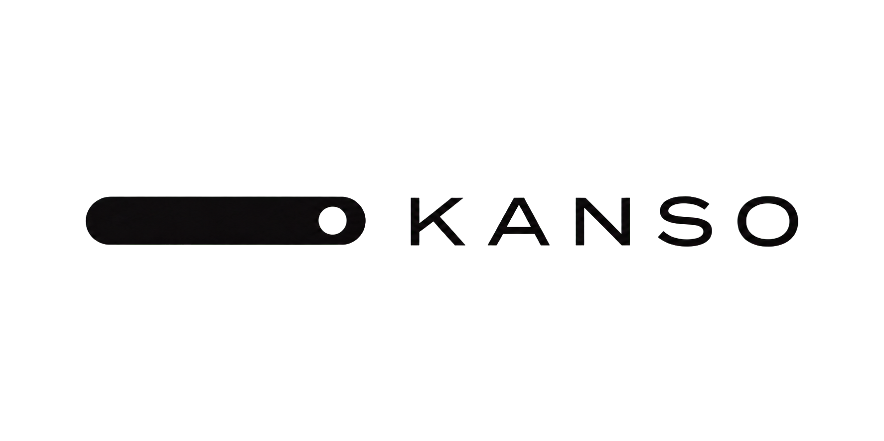
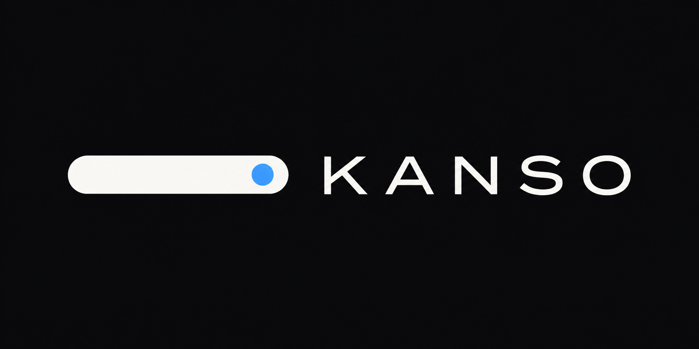

<p align="center">
  
</p>

<p align="center">
  <strong>No echo. Every detail once.</strong>
</p>

<p align="center">
  Clean stream marks for <a href="https://github.com/NuvioMedia">Nuvio</a> —
  an Instant <a href="https://github.com/Viren070/AIOStreams">AIOStreams</a> formatter
  paired with three badge skins.<br/>
  Every useful fact about a stream, shown <em>once</em>.
</p>

<p align="center">
  <a href="https://github.com/nosvasedis/Kanso"></a>
  <a href="#install"></a>
  <a href="#install"></a>
  <a href="#styles"></a>
  
</p>

<p align="center">
  <a href="#install">Install</a> ·
  <a href="#styles">Styles</a> ·
  <a href="#how-it-works">How it works</a> ·
  <a href="#requirements">Requirements</a>
</p>

---

## Why Kanso?

| | |
|:--|:--|
| **Rich** | Resolution, quality, release tiers, dynamic range, Smart Audio/Visual merges, editions, languages, streaming services |
| **Clean** | Readable AIOStreams rows — badges carry the technical signal |
| **Once** | Best-wins + merge badges (e.g. DV · HDR10+) suppress duplicates |
| **Instant** | Invisible markers → tiny Nuvio regex → icons from this repo |

Kanso is built for Nuvio. It is **not** a Universal “match the whole filename” pack.

---

## Install

### 1 · AIOStreams formatter

1. Open AIOStreams → **Formatter** → Custom  
2. Import this file (or paste the export texts — keep invisible characters):

```text
https://raw.githubusercontent.com/nosvasedis/Kanso/main/formatter.json
```

Paste alternatives:

```text
https://raw.githubusercontent.com/nosvasedis/Kanso/main/formatter-export-name.txt
https://raw.githubusercontent.com/nosvasedis/Kanso/main/formatter-export-description.txt
```

3. Raise the template limit (see [Requirements](#requirements))

### 2 · Nuvio badges

**Settings → Streams → Stream Badges** → paste **one** raw URL:

| Style | Import URL |
|:------|:-----------|
| **Solid** | `https://gist.githubusercontent.com/nosvasedis/7abd79424bb8981b511838524c52f097/raw/kanso-solid.json` |
| **Transparent** | `https://gist.githubusercontent.com/nosvasedis/63b769d205bddbbef79faf8beef53c28/raw/kanso-transparent.json` |
| **Mono** | `https://gist.githubusercontent.com/nosvasedis/1858e332fef11d136f76c697ea6c7439/raw/kanso-mono.json` |

Same packs live in-repo: [`kanso-solid.json`](kanso-solid.json) · [`kanso-transparent.json`](kanso-transparent.json) · [`kanso-mono.json`](kanso-mono.json)

> Refresh Nuvio after changing the badge URL so icons reload from `/files`.

---

## Styles

| Pack | Feel |
|:-----|:-----|
| **Solid** | Filled pills, strong color hierarchy |
| **Transparent** | Outline / glass-friendly |
| **Mono** | High-contrast monochrome for dark UIs |

Matching rules are identical — only art and colors change.

<p align="center">
  
  &nbsp;&nbsp;
  
</p>

---

## How it works

```text
  stream fields / Vidhin
            │
            ▼
  Kanso formatter  ──►  invisible markers + clean layout
            │
            ▼
  Nuvio matches tiny marker regex
            │
            ▼
  badge icons from  /files/  (this repo)
```

No multi‑KB release-group regex in the badge packs. Detection happens in the formatter; Nuvio only looks for markers.

---

## Requirements

- [Nuvio](https://github.com/NuvioMedia) with stream badge JSON import  
- [AIOStreams](https://github.com/Viren070/AIOStreams) custom formatter  
- Host env: **`MAX_FORMATTER_TEMPLATE_LENGTH` ≥ `16000`**

Optional: Vidhin-style ranked stream expressions so release **tiers** use `stream.rseMatched` (release-group fallbacks are included).

---

## Credits

Marker / Instant architecture inspired by the community pattern in [kingsizew/badges](https://github.com/kingsizew/badges).  
Kanso uses its **own** marker lexicon, packs, and tooling.

---

<p align="center">
  
</p>

<p align="center"><em>No echo. Every detail once.</em></p>
